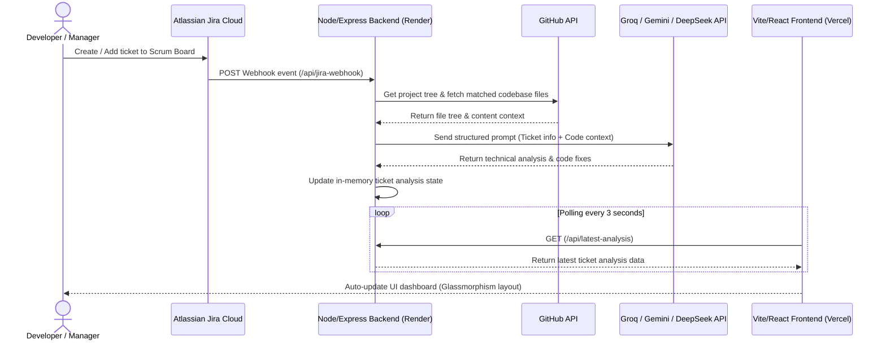
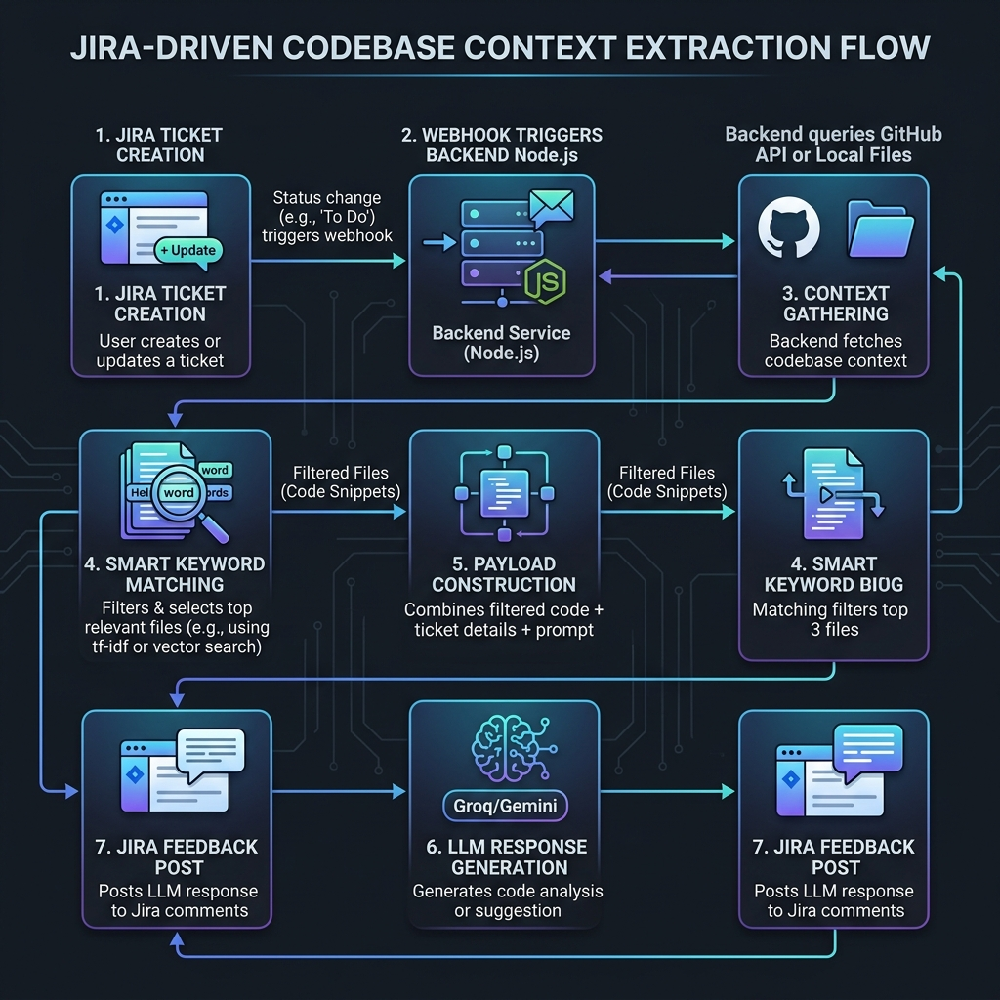

# Agentic JIRA Ticket Technical Analyzer (ICIMS MVP)

An automated technical analysis engine that intercepts Jira issue creation events in real-time, scans target codebase files directly from the GitHub API, and leverages high-speed Cloud LLMs (via Groq/Gemini/DeepSeek) to generate instant code-level recommendations and architectural solutions.

---

## 🚀 Architectural Workflow



### Detailed Context Extraction Diagram


---

## 🛠️ Technology Stack

* **Frontend**: React (Vite), Glassmorphism styling system, Axios polling.
* **Backend**: Node.js, Express, Axios client.
* **Integrations**:
  * **Jira Webhooks**: Real-time HTTP trigger events.
  * **GitHub REST API**: On-demand repository files extraction.
  * **LLM Provider**: Native integrations with **Groq Cloud** (Llama 3.1), **Google Gemini** (1.5 Flash), or **DeepSeek** (deepseek-chat).

---

## ⚙️ Configuration & Environment Variables

Create a `.env` file inside the `backend/` folder based on `backend/.env.example`:

```env
# 1. Choose your preferred LLM Provider (The backend prioritizes keys in this order)
DEEPSEEK_API_KEY=your_deepseek_api_key
GEMINI_API_KEY=your_gemini_api_key
GROQ_API_KEY=your_groq_api_key
OPENAI_API_KEY=your_openai_api_key

# 2. GitHub REST API Access (Enables cloud-based codebase scanning)
GITHUB_TOKEN=your_github_personal_access_token
GITHUB_OWNER=your_github_username_or_org
GITHUB_REPO=your_target_repository_name
GITHUB_BRANCH=main
```

---

## 💻 Local Development Setup

### 1. Backend Server Setup
Navigate to the `backend` folder:
```bash
cd backend
npm install
# Configure your .env file
npm start
```
*The server will run on `http://localhost:5001`.*

### 2. Frontend Dashboard Setup
Navigate to the `frontend/icims` folder:
```bash
cd frontend/icims
npm install
npm run dev
```
*The client dashboard will run on `http://localhost:5173`.*

---

## ☁️ Cloud Deployment Guide

This MVP is fully optimized for zero-cost cloud deployment:

### Backend Deployment (Render.com)
1. Deploy as a **Web Service** connected to your GitHub repository.
2. Configure settings:
   - **Root Directory**: `backend`
   - **Build Command**: `npm install`
   - **Start Command**: `node server.js`
3. Enter your **Environment Variables** in the Render settings page (`GROQ_API_KEY`, `GITHUB_TOKEN`, etc.).
4. *Optional*: Set up a free HTTPS ping on [UptimeRobot](https://uptimerobot.com/) targeting your Render URL `/api/latest-analysis` every 10 minutes to prevent the Render free-tier from entering sleep mode.

### Frontend Deployment (Vercel)
1. Import your repository into **Vercel**.
2. Configure settings:
   - **Root Directory**: `frontend/icims`
   - **Framework Preset**: `Vite`
3. Add the build environment variable:
   - **`VITE_BACKEND_URL`** = `https://<your-render-app-name>.onrender.com`
4. Click **Deploy**.

### Jira Webhook Setup
1. In your Atlassian Jira Cloud instance, go to **Jira Settings > System > Webhooks**.
2. Click **Create a Webhook**.
3. Set the **URL** to: `https://<your-render-app-name>.onrender.com/api/jira-webhook`.
4. Check **Issue: Created** under the Trigger Events list and click **Save**.
