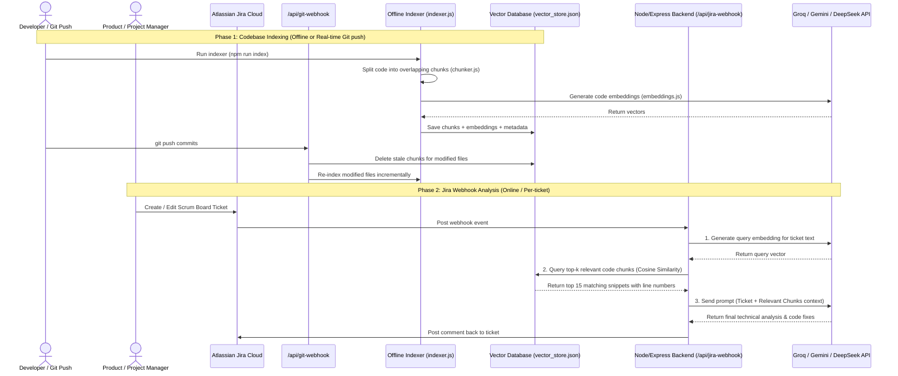

# Agentic JIRA Ticket Technical Analyzer (Scalable RAG Edition)

An automated technical analysis engine that intercepts Jira issue creation events in real-time, queries a local semantic vector database to retrieve context-aware code chunks (avoiding full repository scans), and leverages high-speed Cloud LLMs (via Groq/Gemini/DeepSeek/OpenAI) to generate instant code-level recommendations and architectural solutions.

---

## 🚀 Architectural Workflow

### Efficient RAG System (Two-Phase Execution)


---

## 🛠️ Technology Stack

* **Frontend**: React (Vite), Glassmorphism styling system, Axios polling.
* **Backend**: Node.js, Express, Axios client.
* **Semantic Search Engine**:
  * **Chuncker**: Custom lines-aware code splitter with overlap bounds.
  * **Embeddings Handler**: Multi-provider wrapper supporting OpenAI (`text-embedding-3-small`), Google Gemini (`text-embedding-004`), and local Ollama (`nomic-embed-text`).
  * **Local Vector Store**: Built-in Javascript vector engine executing high-speed in-memory cosine similarity checks, persisted in `vector_store.json` (zero native C++ dependencies for seamless Windows compatibility).
* **Integrations**:
  * **Jira Webhooks**: Real-time HTTP trigger events.
  * **Git Push Webhooks**: Real-time incremental source index synchronizations.

---

## ⚙️ Configuration & Environment Variables

Create a `.env` file inside the `backend/` folder based on `backend/.env.example`:

```env
# 1. LLM API Key (Backend uses this key order for embeddings & content)
DEEPSEEK_API_KEY=your_deepseek_api_key
GEMINI_API_KEY=your_gemini_api_key
GROQ_API_KEY=your_groq_api_key
OPENAI_API_KEY=your_openai_api_key

# 2. GitHub REST API Access (For Cloud Indexing - Option A)
GITHUB_TOKEN=your_github_personal_access_token
GITHUB_OWNER=your_github_username_or_org
GITHUB_REPO=your_target_repository_name
GITHUB_BRANCH=main

# 3. Local Workspace Path (For Local Files Indexing - Option B)
# If left blank, defaults to '../repo/nextjs-dnd/src'
REPO_PATH=c:\AIAutomationMVP\repo\nextjs-dnd\src

# 4. Local Ollama Fallback Settings (If no cloud API keys are present)
OLLAMA_EMBED_URL=http://localhost:11434/api/embeddings
OLLAMA_EMBED_MODEL=nomic-embed-text
```

---

## 💻 Local Development Setup

### 1. Backend Server Setup
Navigate to the `backend` folder and install dependencies:
```bash
cd backend
npm install
```

### 2. Run Codebase Indexing (Offline/Initial Setup)
Ensure you have either a cloud API key configured in `.env` (Gemini or OpenAI) or local Ollama running with the `nomic-embed-text` model:
```bash
# To run Ollama locally
ollama pull nomic-embed-text

# Index the codebase
npm run index
```
*This will create the codebase cache file `vector_store.json` inside the `backend/` directory.*

### 3. Start the Backend Server
```bash
npm start
```
*The server will run on `http://localhost:5001`.*

### 4. Start the Frontend Dashboard
Navigate to the `frontend/icims` folder:
```bash
cd ../frontend/icims
npm install
npm run dev
```
*The client dashboard will run on `http://localhost:5173`.*

---

## ☁️ Cloud Deployment & Webhooks

### Jira Webhook Setup
1. In your Atlassian Jira Cloud instance, go to **Jira Settings > System > Webhooks**.
2. Set the **URL** to: `https://<your-backend-domain>/api/jira-webhook`.
3. Check **Issue: Created** and **Issue: Updated** under the Trigger Events list and click **Save**.

### Git Push Webhook Setup (Incremental Updates)
To sync your database instantly when new code commits are pushed:
1. In your GitHub repository settings, navigate to **Webhooks > Add webhook**.
2. Set the **Payload URL** to: `https://<your-backend-domain>/api/git-webhook`.
3. Select **Content type** as `application/json`.
4. Choose **Just the push event** and click **Add webhook**.
