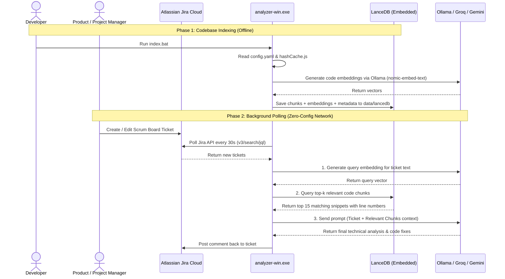

# Agentic JIRA Ticket Technical Analyzer v2.2 (Dual-Tier Edition)

An automated technical analysis engine featuring a **Dual-Tier Architecture** that intercepts Jira issue events in real-time, matches them against codebase indexes using **Semantic Vector Search (RAG)**, and posts technical recommendations directly back to Jira.

---

### 📂 POC Documentation & Architecture Review
For managers and solution architects reviewing this Proof of Concept, please see the complete, detailed architectural design, decision log, trade-off analysis, and enterprise scaling strategy here:
👉 **[POC Architecture Blueprint & Technical Documentation](file:///c:/AIAutomationMVP/docs/poc_architecture_blueprint.md)**

---


## 🚀 Architectural Workflow

### Efficient RAG System (Two-Phase Execution)


---

## 🛠️ Technology Stack

* **Standalone Binary**: Packaged using `pkg` — runs without Node.js installation on client machines.
* **Semantic Search Engine**:
  * **Embeddings**: Local Ollama (`nomic-embed-text`).
  * **Local Vector Store**: **LanceDB** built-in, persisting vectors inside the local `data/lancedb/` folder (Zero external database dependencies).
* **LLM Router Engine with Auto-Fallback**:
  * **Cloud First**: Uses powerful models like Groq (`llama-3.3-70b`) with a defined `dailyCloudTokenLimit` (e.g. 100k tokens/day).
  * **Local Fallback**: Automatically falls back to Local `qwen2.5-coder:3b` via Ollama once the daily cloud limit is hit, ensuring zero-cost operation at scale.
  * **Anti-Hallucination**: Injects the repository file tree structure to prevent local models from hallucinating non-existent files.

---

## 📦 Distribution & Client Setup

The system is delivered to clients as a single ZIP folder containing:
1. `analyzer-win.exe`
2. `config.yaml`
3. `.env`
4. `index.bat` and `start.bat`

### 1. Setup Environment
Clients open `.env` and configure:
```env
# Optional: Add cloud API keys for 2-second generation speeds
GROQ_API_KEY=gsk_...

# Required: Jira Webhook configuration
JIRA_DOMAIN=yourcompany.atlassian.net
JIRA_EMAIL=you@email.com
JIRA_API_TOKEN=ATATT...
```

### 2. Configure Repositories
Clients open `config.yaml` to map their local repositories and Jira projects:
```yaml
repositories:
  - id: "core-platform"
    name: "Core Platform API"
    localPath: "C:\\path\\to\\their\\repo"
    jiraProjects: ["SCRUM", "CORE"]
```

### 3. Build Vector Index (One-Time)
Clients double-click **`index.bat`**. The application scans their local repository, generates embeddings entirely offline using Ollama, and stores them in `data/lancedb/`.

### 4. Start Server
Clients double-click **`start.bat`**. The server boots up on `http://localhost:5001`.

---

## ☁️ Jira Webhook Setup

1. In Jira Cloud, go to **Jira Settings > System > Webhooks**.
2. Set the **URL** to: `http://<client-server-ip>:5001/api/jira-webhook`.
3. Check **Issue: Created** and **Issue: Updated**.
4. Click **Save**.

Whenever a ticket is created under the configured `jiraProjects` prefixes, the executable will intercept the payload, query LanceDB for the relevant source code files, and post a technical analysis back to the ticket automatically.
