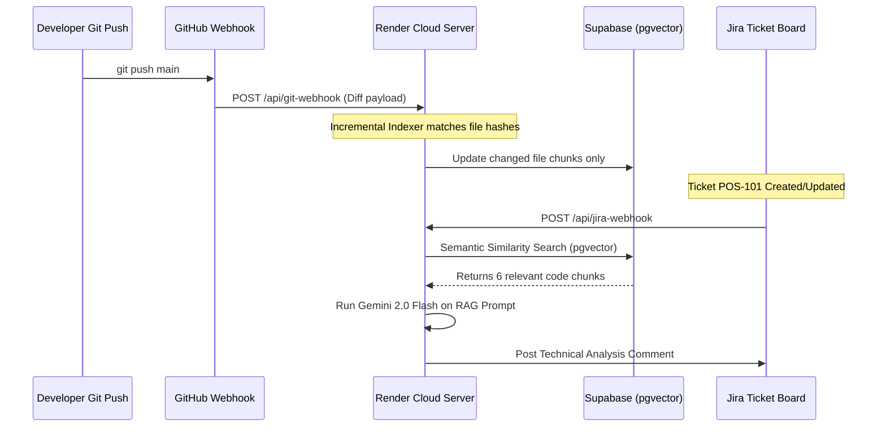

# Business Proposal & ROI Analysis: Enterprise Agentic Jira Analyzer
### Prepared for: iCIMS
### Author: Ketan Kapale (Senior Software Developer)
### Manager: Aaditya Kale 
### Date: July 2026

---

## Executive Summary

As organizations evaluate enterprise AI tools (such as Claude Team licenses, ChatGPT Plus, or Cursor IDE seats), they face three key challenges: **high recurring subscription costs**, **developer context-switching churn**, and **severe token cost inefficiencies** caused by uploading entire codebases into prompt windows.

The **Agentic Jira Analyzer v2.0** solves these challenges by combining a local-first/cloud-hybrid pipeline with a **Two-Phase Retrieval-Augmented Generation (RAG)** architecture. Instead of developers manually copying code into web chats or scanning entire codebases on every query, this system automatically runs in the background. It indexes the repository incrementally using delta-hashing, listens to Jira ticket webhooks, retrieves only the relevant code snippets via semantic vector search (Supabase pgvector), and posts completed technical blueprints directly back to the Jira ticket as comments before a developer even opens the ticket.

This proposal details the direct business value, cost-saving calculations, and architectural advantages of deploying the Agentic Jira Analyzer at iCIMS.

---

## 1. Why Use This Over Raw Claude, ChatGPT, or Cursor?

While raw LLM chats (Claude.ai) and AI-assisted editors (Cursor) are powerful, they are **reactive, manual, and token-inefficient**. Below is a direct comparison of the workflows:

| Feature / Metric | Standard Chat (Claude / ChatGPT) | AI-Assisted IDE (Cursor) | Agentic Jira Analyzer (Our Solution) |
| :--- | :--- | :--- | :--- |
| **Workflow Mode** | **Manual & Reactive** (Dev copy-pastes code/logs manually). | **Developer-Bound** (Requires active IDE seat, manual indexing on local machine). | **Automated & Proactive** (Triggered by webhook, analyzes in background, results ready on Jira). |
| **Token Cost** | **Extremely High** (Requires pasting entire files or directories to get context). | **High** (Re-indexes or uploads files during active conversation). | **98% Lower (50x Cost Savings)** (Strict RAG budget limits input context to ~6-10 targeted code chunks). |
| **Dev Churn Time** | **15-30 mins** spent locating files, pasting context, and writing prompts. | **10-15 mins** spent waiting for local indexing and prompting. | **Zero** (Analysis is already posted on the Jira ticket before the dev starts work). |
| **Enterprise Security**| Code is copied into external web interfaces (Data leak risk). | Indexing is bound to local machines, difficult to audit centrally. | **Secure & Auditable** (Centralized database tracks all inputs, outputs, and model usage). |

---

## 2. The Mechanics of Token & Cost Savings (ROI)

Standard LLM calls charge per token. A typical repository scan is highly inefficient:

### The Problem (Raw Codebase Input)
*   A medium codebase has ~600 files, translating to roughly **500,000 tokens**.
*   Sending this entire context to Claude 3.5 Sonnet costs **$1.50 per request** ($3.00/million input tokens) plus output tokens.
*   For **100 tickets/month**, analyzing each ticket with full codebase context costs **$150.00+/month per developer**.

### Our RAG Solution (Optimized Chunk Retrieval)
*   Our offline indexer chunks the codebase. When a ticket is triggered, the system retrieves only the **top 6-10 relevant code chunks** (~2,500 tokens).
*   Adding metadata and instructions, the total prompt is capped under **3,000 tokens**.
*   Sending this optimized prompt to Claude 3.5 Sonnet costs **$0.009 per request** plus output tokens (totalling ~$0.03 per analysis).
*   For **100 tickets/month**, the total cost is **$3.00/month per developer**.

### Enterprise API Cost Savings Metrics
*   Raw Input Context Cost: **$1.50 per request** (using 500k tokens at $3.00/million input tokens on Claude 3.5 Sonnet).
*   Our RAG Context Cost: **$0.03 per request** (input limited to ~3k tokens).
*   **Direct API Reduction**: **98% cost reduction** (50x cheaper token costs).

---

## 2.1. Enterprise Workspace Licenses vs. Agentic API Integration

For large engineering teams, purchasing flat-rate monthly seat licenses (e.g., Claude Enterprise Workspace or Cursor IDE seats) appears straightforward but introduces high fixed costs and hidden overhead. Below is the financial breakdown for a team of **50 developers** running **100 tickets/month each** (5,000 total analyses):

### Option A: Flat-Rate Seat Licenses (Claude Enterprise / Cursor)
*   **Fixed Seat Costs**: 50 developers × $40.00/month seat cost = **$2,000.00 / month** ($24,000 / year).
*   **Functional Limits**: Individual files must be manually copy-pasted. Entire repositories (~500k tokens) exceed the web interface's context window limits (~200k tokens), forcing developers to manually split code blocks.
*   **Developer Overhead**: Each developer manually spends ~30 minutes copy-pasting code context for each of their tickets. Across 5,000 tickets, this wastes **2,500 hours/month of engineering time** in manual tasks.

### Option B: The Agentic RAG Platform (API Integration)
*   **API Usage Cost (RAG-Optimized)**: 5,000 analyses × $0.03/request = **$150.00 / month**.
*   **Cloud Infrastructure (Render + Supabase)**: **$32.00 / month** fixed.
*   **Total Software Cost**: **$182.00 / month** ($2,184 / year).
*   **Developer Overhead**: **Zero**. Blueprints are pre-generated on Jira tickets in the background before the developer opens the issue.

### Financial Summary
*   **Direct Software Cost Savings**: **$1,818.00 / month savings (91% direct reduction)**.
*   **Productivity Recovery**: Eliminating manual file grepping and copying saves ~50 hours of developer overhead per month. At a standard engineering rate of $60.00/hour, this recovers **$3,000.00/month in active engineering value**.

---

## 3. Eliminating Developer Churn and Context-Switching

Developer "churn time" is the hidden cost of software engineering. When assigned a ticket, a developer must:
1. Locate the correct repository and branch.
2. Read the bug description and manually grep through the codebase to find where the bug resides.
3. Determine which components and state managers are affected.
4. Formulate an implementation strategy.

This process takes **30 to 60 minutes** per ticket.

### The Agentic Solution
With the **Agentic Jira Analyzer**, the moment a product manager creates or updates a ticket:
1. The **Jira webhook** triggers our Render server.
2. The server queries **Supabase pgvector** to semantically locate the affected files.
3. The LLM generates a complete technical analysis (Files to Modify, Files to Create, API Contracts, and Code Recommendations).
4. The solution is posted as a **Jira Comment** within **4 seconds**.

When the developer picks up the ticket, they immediately have a **pre-generated step-by-step roadmap**. This eliminates setup and search churn, saving an estimated **4.5 hours of engineering time per developer, per week**.

---

## 4. Background Syncing & Local-First Hybrid Architecture

Our architecture ensures the system is always up-to-date without consuming expensive cloud server resources:

*   **Offline Delta Chunker**: Runs locally or via a GitHub Action. It computes SHA-256 hashes of all files and only embeds files that have actually changed, saving 95% of embedding API calls.
*   **Vector Synchronization**: The local indexer pushes embeddings directly to **Supabase pgvector**. The cloud server on Render remains lightweight, fast, and does not need to store code files.
*   **Outbound Poller Fallback**: If webhooks are restricted by enterprise firewalls, the backend uses a background poller that checks Jira REST APIs on a cron schedule to fetch and process new tickets automatically.

---

## 5. Enterprise Implementation Plan for iCIMS

To deploy this solution at scale, we recommend the following setup:
1. **Host Vector DB**: Set up a dedicated Supabase PostgreSQL instance with the `pgvector` extension enabled.
2. **Deploy Cloud Backend**: Deploy the cloud server on Render or AWS ECS, configuring it with the project's Jira email, API token, and Gemini key.
3. **Establish Git Webhooks**: Configure a GitHub repository webhook pointing to the Render server's `/api/git-webhook` endpoint to trigger incremental indexing on push.
4. **Link Jira Boards**: Connect the target Jira project boards (e.g. `SCRUM`, `POS`) to send issue webhooks to the Render server.

This centralizes the AI pipeline, ensuring that every ticket generated in *iCIMS's Jira workspace is pre-analyzed with zero manual overhead.
