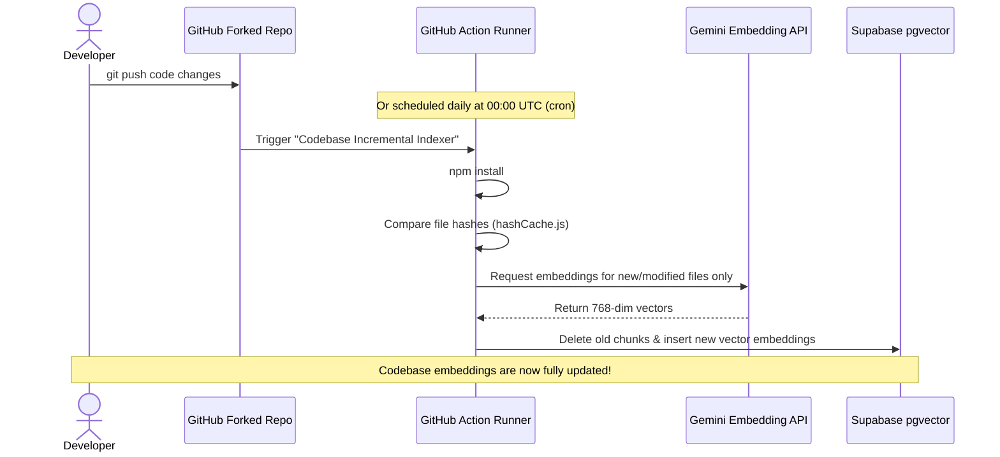
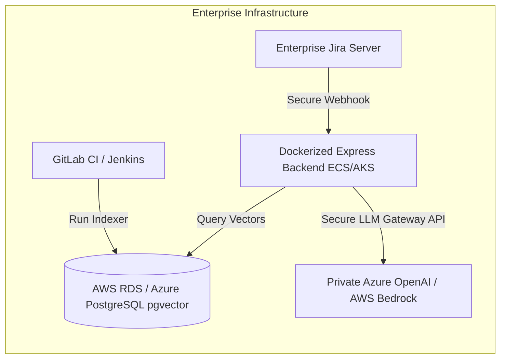
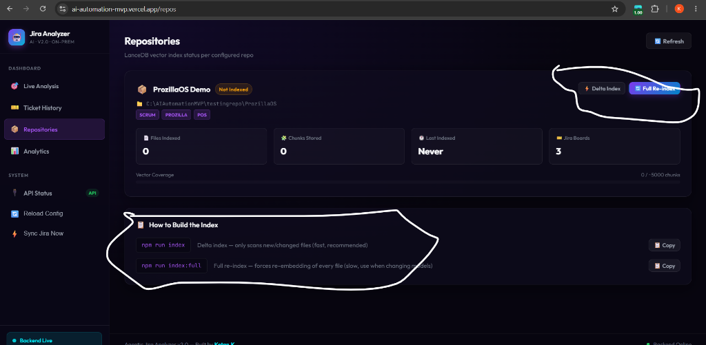
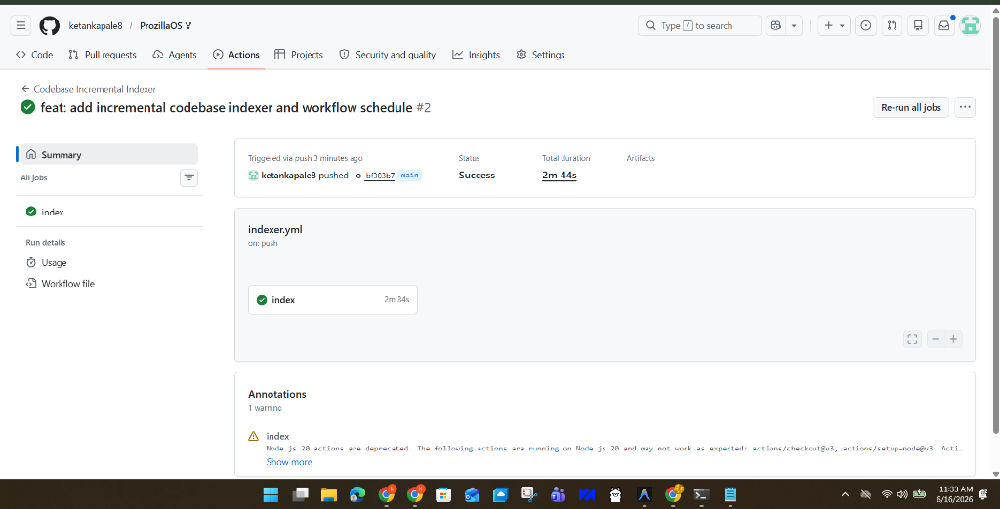
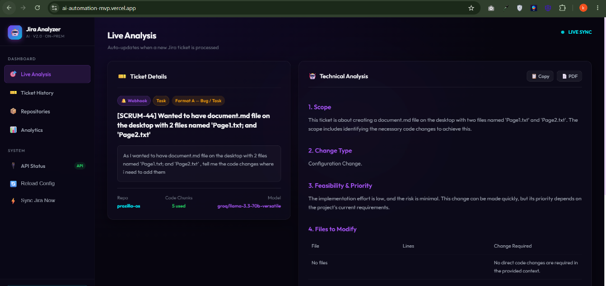
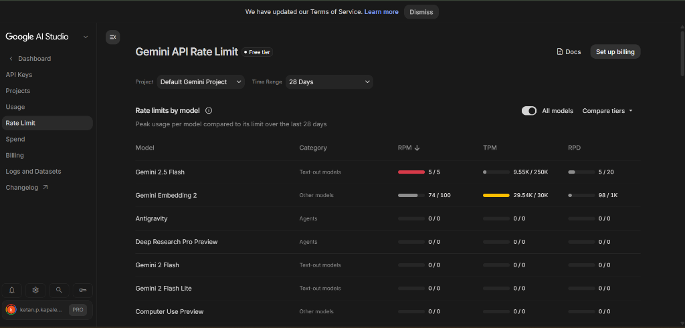

# 🏛️ POC Architecture Blueprint & Technical Documentation
## On-Premise (Offline) & Hybrid Cloud RAG Technical Analyst System

This document outlines the architecture, design choices, trade-offs, and scaling strategy of the **Agentic Jira Ticket Technical Analyst** system. It serves as the official technical blueprint for solution architects, managers, and technical stakeholders reviewing this Proof of Concept (POC) and working Minimum Viable Product (MVP).

---

## 1. Executive Summary & Core Value Proposition

Software engineering teams often spend significant time in the "analysis and planning" phase of a sprint: reading Jira tickets, searching codebases, identifying files to modify, designing API contracts, and writing boilerplate.

This system **automates technical analysis at the ticket creation phase** using **Retrieval-Augmented Generation (RAG)**. 
* **The Process:** When a PM or Developer creates/updates a Jira ticket, the system intercepts it via webhook/polling, performs a semantic search over the codebase vector database to retrieve the relevant code snippets, and sends them along with the ticket description to a reasoning LLM.
* **The Result:** Within seconds, a fully detailed technical analysis (with file modifications, line references, code suggestions, API schemas, and test strategies) is posted as a comment directly on the Jira ticket.

---

## 2. Dual-Tier System Architecture

To meet varying client requirements (strict offline data security vs. zero-maintenance automated cloud hosting), the system is built with a dual-tier architecture.

```mermaid
graph TD
    subgraph On-Premise Offline Tier (Desktop / Local Server)
        A[Jira Cloud / Server] -->|30s API Polling| B[analyzer-win.exe Standalone Binary]
        B -->|Local Scan| C[(Local LanceDB File Store)]
        B -->|Local Embeddings nomic-embed-text| D[Local Ollama Instance]
        B -->|Local Inference qwen2.5-coder:3b| D
    end

    subgraph Serverless Cloud Tier (Automated & Zero-Cost)
        E[Jira Webhook Event] -->|HTTPS POST| F[Render Express Backend]
        G[Git Commit / Daily Cron] -->|Trigger Action| H[GitHub Actions Chunker]
        H -->|models/gemini-embedding-2| I[Gemini Embedding API]
        H -->|Upload Vectors| J[(Supabase pgvector Database)]
        F -->|Semantic Query| J
        F -->|Prompt + Context Chunks| K[LLM Router: Groq / Gemini 2.0]
        K -->|Post Comment| E
    end
```

### A. On-Premise Offline Tier (Standard Enterprise setup)
* **Zero External Data Exposure:** Embeddings generation and inference run entirely offline on a local workstation or private server.
* **LanceDB (Embedded):** A serverless, high-performance vector database stored as flat files inside the local directory. No database installation or setup is needed.
* **Ollama integration:** Uses local models like `nomic-embed-text` (embeddings) and `qwen2.5-coder:3b` (inference).
* **Network Independence:** Uses a background polling loop (checking Jira every 30s) instead of inbound webhooks, meaning clients do not need to configure firewalls, public domains, or expose their ports to the internet.

### B. Stateless Cloud Tier (Our hosted Vercel/Render/Supabase solution)
* **GitHub Actions Chunker:** Offloads CPU-heavy codebase indexing from the server. Indexing runs on GitHub's free runners when code is pushed or via a daily cron schedule.
* **Supabase (pgvector):** Connects to a cloud-hosted PostgreSQL database equipped with `pgvector` to store code embeddings, history, and status.
* **Render (Express Backend):** Runs a stateless web server that listens for inbound Jira webhooks. It performs query vectorization, queries Supabase, builds the prompt, routes it to the LLM, and comments on Jira.
* **Vercel (React Frontend):** Provides a visual dashboard showing real-time logs, ticket history, database stats, and repository status.

---

## 3. Deep-Dive Design Decisions

### Why Supabase PostgreSQL instead of LanceDB in the Cloud?
1. **Stateless Compliance:** Cloud providers like Render (free tier) spin down and erase local container filesystems when idle. LanceDB, being file-based, would lose the index. Supabase provides persistent, relational, and vector storage in a single hosted DB.
2. **The IPv4 Port 6543 Solution (Supavisor):** Render's free tier does not support outbound IPv6 connections, preventing direct communication with standard Supabase database strings (which resolve to IPv6 on port 5432). We bypassed this by utilizing the **Supavisor connection pooling string on port 6543**, which routes traffic successfully over IPv4.

### Why GitHub Actions for Chunking & Indexing?
Running character chunking, AST building, and embedding generation inside the Render Express container would hit memory limits and trigger request timeouts on the free tier. 
* By placing the indexer in a GitHub Actions workflow, we utilize GitHub’s **free runner minutes** to process the files.
* Pushing code or triggering the cron job starts the runner, chunks the codebase, calls Gemini for embeddings, and writes them straight to Supabase. This keeps the Render backend completely stateless, lightweight, and fast.

---

## 4. Local LLM Limitations vs. Cloud LLMs

While local models provide absolute privacy, they present severe trade-offs compared to cloud models:

| Dimension | Local LLM (e.g., Qwen 2.5 Coder 3B / Llama 3 8B) | Cloud LLMs (Gemini 2.0 Flash / Groq Llama 3.3) | Impact on POC/MVP |
| :--- | :--- | :--- | :--- |
| **Inference Speed** | **Slow:** 60 to 180+ seconds per analysis (highly dependent on local CPU/GPU). | **Extremely Fast:** 2 to 7 seconds per analysis. | Cloud provides a vastly superior, instant developer experience. |
| **Context Window** | **Limited:** Typically 4k to 8k tokens. Prompt truncation is frequently required. | **Massive:** 1M+ tokens (Gemini 2.0). Can receive dense codebase context. | Cloud tier can ingest up to 25 code chunks for complex feature tasks; local tier is limited to ~5. |
| **Hardware Overhead** | **High:** Workstation requires minimum 16GB RAM (32GB recommended) and dedicated VRAM (GPUs) to run reasonably. | **Zero:** Runs on any client machine, including low-power laptops. | Cloud requires no local hardware provisioning. |
| **Hallucination Rate** | **Moderate-High:** Smaller models easily hallucinate file structures or libraries when context is complex. | **Very Low:** Advanced models with codebase-tree injection adhere strictly to constraints. | Cloud provides spot-on, production-grade technical analyses. |

---

## 5. Token Optimization & Anti-Hallucination Controls

To prevent expensive token usage and maintain strict technical accuracy, we implemented three key mechanisms:

### A. Dynamic Context Sizing (Complexity Tiering)
When a ticket arrives, the LLM Router classifies it into a complexity tier:
* **Simple (Bugs, Tasks, Chore):** Restricts vector search retrieval to **5 code chunks** (approx. 1,500 input tokens) to minimize embedding cost.
* **Complex (Stories, Features, Epics):** Elevates retrieval to **25 code chunks** (approx. 6,000 input tokens) to give the LLM a comprehensive blueprint of the affected modules.

### B. AST Chunker & Comments Stripping
Before sending code chunks, the indexer and prompt builder strip out single-line/multi-line comments and collapse consecutive blank lines. This compresses code context by **30% to 50%**, ensuring we maximize code logic density inside the LLM's prompt window.

### C. Strict Anti-Hallucination Prompt Constraints
In [promptBuilder.js](file:///c:/AIAutomationMVP/AIAutomationCloud/promptBuilder.js), we injected the repository's real folder tree structure and enforced strict system instructions:
> `CRITICAL: If the codebase context is empty or does not contain code chunks matching the ticket, you MUST respond exactly with: "This request is out of scope. I do not have the relevant code context to analyze this ticket."`
> `CRITICAL: You must ONLY suggest modifying files that are explicitly listed in the codebase context. Do not invent files.`

---

## 6. How the Automated GitHub Cron & Git Push Integration Works

The indexing pipeline is completely automated through the GitHub Actions workflow file:



---

## 7. Enterprise Scaling Strategy

To transition this POC/MVP to an enterprise-grade production environment, we recommend the following scaling path:



1. **Secure Vector Storage:** Transition the free-tier Supabase database to a managed enterprise database like **AWS RDS PostgreSQL** or **Azure Database for PostgreSQL** with the `pgvector` extension enabled, residing inside a private virtual network (VPC).
2. **CI/CD Indexer Integration:** Move the indexing scripts from GitHub Actions to the enterprise's private runner environment (e.g., **GitLab CI runners, Jenkins nodes, or Azure DevOps pipelines**). This ensures that codebase files never leave the company's secure network during chunking.
3. **Private LLM Gateways:** Replace public API endpoints with secure enterprise gateways such as **Azure OpenAI (private endpoints)** or **AWS Bedrock**. This keeps all prompts, ticket descriptions, and code snippets fully private and compliant with corporate data governance.
4. **Dockerization:** Package the cloud Express backend into a standard Docker image and run it on container orchestration services like **AWS ECS (Fargate)** or **Azure Kubernetes Service (AKS)** behind an enterprise API Gateway.

---

## 8. Dashboard UI & Verification Snapshots

Below are references to the live web interface showing the repository status, index verification, action workflow logs, and ticket analytics history:

### A. Repositories Status Dashboard
Displays the metadata of indexed codebases, showing total file count, chunks stored on Supabase, and last index run timestamp.


### B. Automated GitHub Actions Workflow
The codebase incremental indexer executing successfully on push, compiling dependencies, and generating embeddings using Gemini.


### C. Live Technical Analysis UI
Real-time analysis output triggered via Jira webhooks, detailing the complexity tier, chunks retrieved from Supabase, change type, and suggested code modifications.


### D. Ticket History Analytics Log
Centralized log of all processed analyses retrieved dynamically from the database pool.


---

## 9. Sample Output Reference

For a complete, raw PDF export of a generated technical analysis from a real Jira ticket, refer to the document:
👉 **[SampleAnalysisForATicket.pdf](SampleAnalysisForATicket.pdf)**

---

*Developed and maintained for iCIMS by **Ketan.K***
